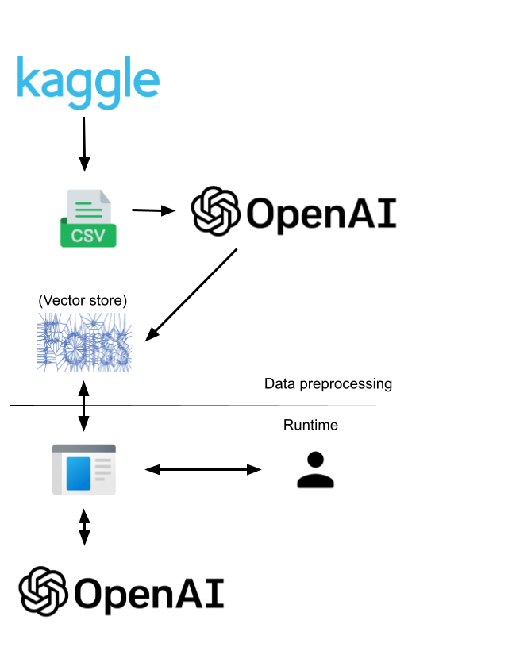

# KaggleMateAI
## :warning: Project Status: Prototype Phase :warning:

This project is currently in the prototype phase and is subject to changes. While it aims to achieve the features listed below, please note that not all have been implemented yet. 

## Overview

KaggleMateAI is an open-source tool designed to assist data scientists and machine learning enthusiasts in navigating the vast landscape of Kaggle competitions. Utilizing Language Model (LLM) techniques, KaggleMateAI finds competitions that are similar to your machine learning problem description. 

The architecture of the application is the following:



## Installation

```bash
git clone https://github.com/romathonat/KaggleMateAI.git
cd KaggleMateAI
poetry install
```
To update the csv with new information from kaggle, you need to have a kaggle account, with your credentials provided in ~/.kaggle/kaggle.json  
You also need to have a working openAI key as an environment variable (let's say in your ~/.profile or ~/.bashrc):
export OPENAI_API_KEY="<my_key>"

**NB**: If it is the first time you are trying to use the API endpoint from openAI, it seems that you need to enter a credit card first to be able to call it, event if you have free credits.

## Usage
To update data (scrap online and update the vector store). Note that it will only add to the vector store the competitions that are not already there, in order to limit the number of api calls.

``` bash
python -m scripts.update_data
```

To look for a competition similar to your problem, provide a description in scripts/get_similar_competition.py, then launch:

``` bash
python -m scripts.get_similar_competition
```

TODO: make a CLI to make it more user friendly

## Technical implementation
I tried to follow a Test Driven Developement approach, using a port-adapter / clean architecture to modularize the different parts. This makes it easier to replace them and to test the application using stubs to reduce coupling between tests and code.

### License

This project is licensed under the MIT License - see the LICENSE.md file for details.

Icons by [icones8](https://icones8.com/)